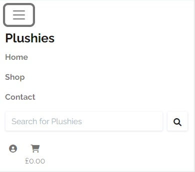
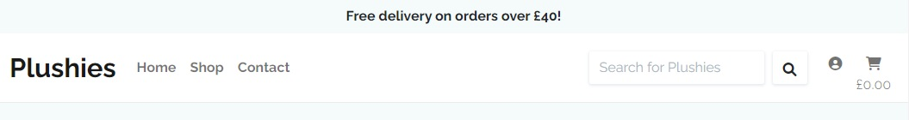
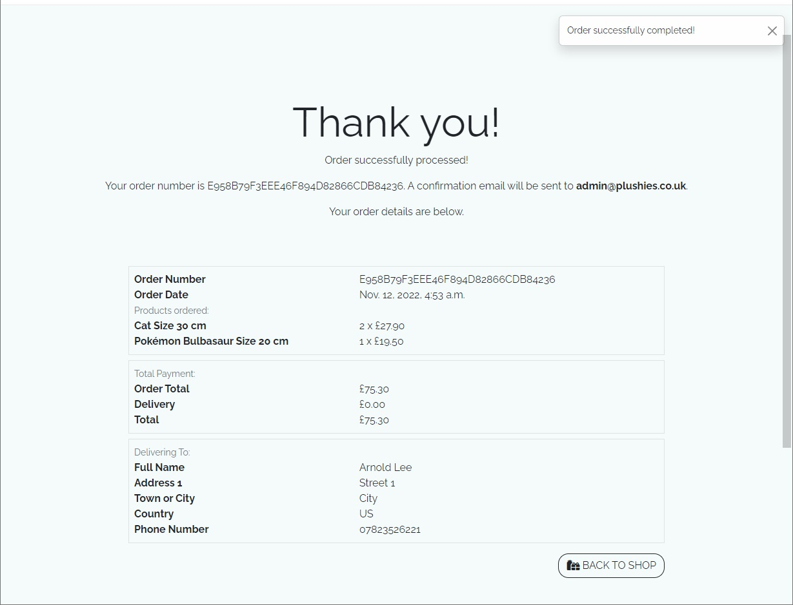
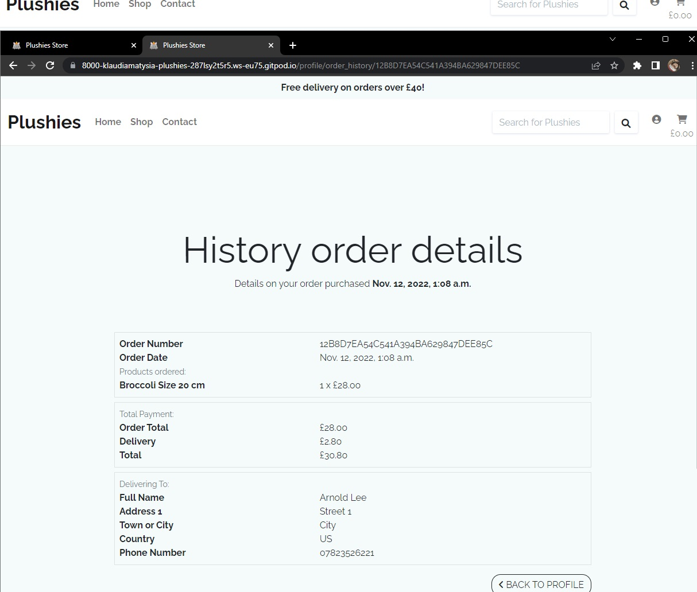
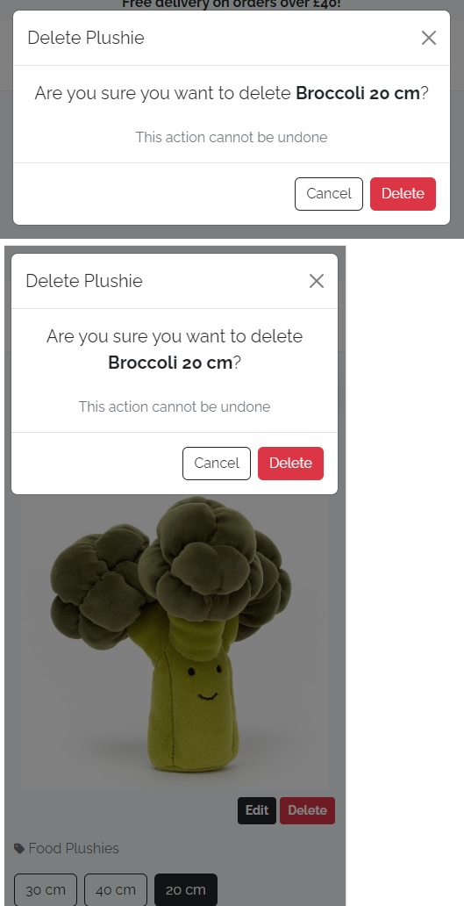

# Plushies
## Table of Contents
* [Introduction](#introduction)
* [UX](#ux)
    * [User Stories](#users-tories)
    * [Design](#design)
    * [Wireframes](#wireframes)
        * [Mobile Wireframes](#mobile-wireframes)
        * [Desktop Wireframes](#desktop-wireframes)
* [Database](#database)
* [Features](#features)
    * [Navbar](#navbar)
    * [Home Page](#home-page)
    * [Footer](#footer)
    * [Shop Page](#shop-page)
    * [Contact](#contact)
    * [Shopping Cart](#shopping-cart)
    * [Checkout](#checkout)
    * [Successful checkout](#successful-checkout)
    * [Register](#register)
    * [Verify Email](#verify-email)
    * [Login](#login)
    * [Logout](#logout)
    * [User Profile](#user-profile)
    * [History order details](#history-order-details)
    * [Admin Page](#admin-page)
        * [Add the Product](#add-the-product)
        * [Edit the Product](#edit-the-product)
        * [Delete modal for admin](#delete-modal-for-admin)
    * [Messages](#messages)
* [Technologies Used](#technologies-used)
    * [Languages](#languages)
    * [Libraries and Programs](#libraries-and-programs)
* [Testing](#testing)
* [Deployment](#deployment)
* [Credits](#credits)

# Introduction
The live project you can find [here](https://plushies.herokuapp.com)

The Plushies project is an eCommerce store with plushies. The site is designed within Django structure, deployed on Heroku, utilizes cloud storage AWS S3 to host media and static records. The website provides role based permissions for users to interact with a central dataset. It includes user authentication, email validation and full CRUD functionality for admin users for Products. Please note that this website is for eductional purposes only. Do not enter any personal credit/debit card details. 

## Testing Payment with Stripe
As a way of exemplifying how the payment functionality works, Stripe provides three types of payment events and their respective card numbers: successful payment, requires authentication and failed payment.

| Payment event | Card Number
|:---:|:---:|
|Successful payment|4242 4242 4242 4242
|Requires authentication|4000 0025 0000 3155
|Failed payment|4000 0000 0000 9995

Additional information:
* Use a valid future date.
* Use any three-digit CVC.


# UX

## User Stories
### User
* As a user, I want to view a list of products to purchase.
* As a user, I want to view selected individual product details, the price, size, description and image.
* As a user, I want to view the total of my purchases at any time.
* As a user, I want to view a store contact information.
* As a user, I want to contact easily with store owner via message form.
* As a user, I want to register an account, so I can have a pesonal account to view my profile.
* As a user, I want to receive an email confirmation after registering account to verify that my account registration was successful.
* As a user, I want to login and logout to access my personal account information
* As a user, I want to easily enter my payment information so I can checkout quickly.
* As a user, I want to be able recover my password so I have access to my account
* As a user, I want to have a personalised user profile so I can view my order history, order confirmations, and save my payment information.
* As a user, I want to sort the list of available products by price, by name or by category name.
* As a user, I want to sort a specific category of product by price or by name.
* As a user, I want to search for product by name or color to find specific product.
* As a user, I want to see what I've searched for and how many products was found
* As a user, I want to select the size and quantity of a product.
* As a user, I want to view products in my cart and identify total cost of my purchase.
* As a user, I want to modify the quantity of individual items in the cart, so I can make a change to my purchase before checkout.
* As a user, I want to receive a confirmation email after checkout, to keep the confirmation for my records.
### Store Owner
* As a store owner, I want to add products to my store.
* As a store owner, I want to edit the product details.
* As a store owner, I want to delete the products that are no longer for sale.

## Design

The colors palettes for website layout are Cultured, White, and Dark Slate Grey. For the links in the Register and Login page is used Ming color.

## Wireframes
I created wireframes in the Balsamiq program as first visual concept of the website.

### Mobile Wireframes
[PDF file here](documentation/mobile-wireframes.pdf)


### Desktop Wireframes
[PDF file here](documentation/desktop-wireframes.pdf)


## Database
To create database schema I used [dbdiagram.io](https://dbdiagram.io/)


## Features
### Navbar
The navigation bar style is consistent. It navigates user through the website. Main bar includes links to the Home, Shop, Contact, Login, Register page, Shopping Cart, Search bar and button, and Plushies logo. While user is logged in from user icon it goes dropdown menu with two links: My Profile and Log out. As a superuser see another link on that dropdown menu, which is Admin link. While user add products, the total of the purchase will update. Above navbar there is a free delivery banner above certain amount. User can search on the search bar for products, the query search by product's name and color.

* Mobile

    

    

* Desktop

    

* Dropdown menu as logged out user

    

* Dropdown menu as logged in user

    

* Dropdown menu as logged in admin

    

* Output for searching queries

    

### Home Page
On the home page user see a hero image which is a grey plushie, text "Plushies are the great companions Love Laugh Fun", and SHOP NOW button. In the next section there is High Quality header, text and image. On the mobile view content is centered. On the desktop view Hero Image is positioned on the right and hero text is on the left, and splitted into two halfs. High Quality image is positioned on the left and its text on the right, and splitted with 8/12 and 4/12.

* Mobile

    

    

* Desktop

    


### Footer
Footer contains couple sections. General message from Plushies team, Categories links, Contact information, Disclaimer and social links with Font Awesome Icons to Facebook, Twitter, and Instagram.

* Mobile

    

* Desktop

    

### Shop Page
On the shop page user can see listed plushies products. On the extra large screens are four products in the row, on the large screens are three products in the row, on the medium screens are two products in the row, and on the small screens is one product in the row. Every product is placed on the tile that contains product's image, name, starting price and category. User can open link for details of the chosen product by clicking either image or name. User can sort products by price, by name, by category name. On the menu are oprtions to display products only from one category, and on that page user can sort products by price, and by name from one category. Admin can see also buttons for editing and deleting the product. On the bottom of the screen is placed the fixed button, that can take user to the top of the page.

* Mobile

    

* Desktop

    

* Sorting

    

* Fixed button

    

* Admin view

    

### Contact
On the Contact page user see opening hours of the store, text about how to contact store staff, and message form with submit button.

* Mobile

    
    
    

* Desktop

    

### Shopping Cart
If user doesn't add any products, the content of the cart is text 'Your cart is empty' with Keep Shopping button. If user add products to the shopping cart, it displays list of products. Every item in the cart has image, name, size, buttons to change quantity, price and delete from cart button. Beneath products list user can find total of the purchase along with button for secure checkout, or button to keep shopping.

* Mobile

    

* Desktop

    

* Empty Cart

    

### Checkout
On the checkout page user see form to fill in for contact, delivery and payment details, order summary, and buttons to return to cart and to complete the order. On the form required field are full name, email, phone number, street line 1, city, country, and payment.

* Mobile

    

    

* Desktop

    
    
    

### Successful checkout
User see Thank you title with his order number, and that confirmation email will be sent to his email. Below that message user see order details. In the bottom right corner is button to go back to browsing products.

* Mobile

    
    
    


* Desktop

    

### Register
User can register an account on the website to have faster checkout process with saved profile information. On the register page is form with email address, email address confirmation, username, password, password confirmation, and register button. Above form user can find link to login page.

* Mobile

    
    
* Desktop

    

### Verify Email
On the verify email page user can read information to check his email box to continue registration account, and notification pops up.

* Mobile

    
    
* Desktop

    

### Login
On the login page user can see form with username or email, password to fill in, and login button. Use has option to stay logged in. by clicking Remember Me box. Above form there is link to registration page. User also has option to retrieve account if forgot the password.

* Mobile

    
    
* Desktop

    

### Logout
On the logout page user need to confirm log out process by clicking on the Log Out button.

* Mobile

    
    
* Desktop

    

### User Profile
On the My Profile page user see form for deafult information that can save it for the next purchase, and also order history.

* Mobile

    
    
    


* Desktop

    

### History order details
On the history order details user can see his history of purchase with all the details, and back to profile button.

* Mobile

    
    
    


* Desktop

    

### Admin Page
#### Add the product
On the admin page is for to add product to the store. The form has category, name, description, price, size, color, made in, image fields.

* Mobile

    
    
    

#### Edit the product
Admin can edit products. On the page is form with category, name, description, price, size, color, made in, image fields to edit the product.

* Mobile

    
    
    


* Desktop

    

* Desktop

    

#### Delete modal for admin
Admin can see delete modal. On the model there is a confirmation for the delete process.



### Messages
User can notice success message with transparent background, error message with red background, and information message with blue background. Messages notify user about action being made on the website.


# Technologies Used
##  Languages
* HTML5
* CSS3
* Python
* Javascript
## Libraries and Programs
* [Git](https://git-scm.com/) - Git was used for version control.
* [GitHub](https://github.com/) - GitHub was used for storing code and deploying the site.
* [Gitpod](https://www.gitpod.io/) - GitPod was used for building and editing my code.
* [Heroku](https://www.heroku.com/) - Heroku was used to deploy the project.
* [Django](https://www.djangoproject.com/) - Django was used for creating store website.
* [PostgreSQL](https://www.postgresql.org/) - PostgreSQL was used to store products, products sizes and categories, users, user's profiles, orders colections in the database
* [AWS S3](https://aws.amazon.com/s3/) - AWS S3 was used for storing media and static files.
* [Stripe](https://stripe.com/en-gb) - Stripe was used for payment gateway.
* [Bootstrap 5](https://getbootstrap.com/docs/5.2/getting-started/introduction/) - Bootstrap 5 was used to desgin responsive website.
* [jQuery](https://jquery.com/) - jQuery was used to implement JavaScript.
* [Chrome Developer Tools](https://developers.google.com/web/tools/chrome-devtools) - Chrome Developer Tools was used to help fix problem areas and identify bugs.
* [Font Awesome](https://fontawesome.com/) - The icons for cookie logo, social media and buttons were taken from Font Awesome.
* [Google Fonts](https://fonts.google.com/) - The font 'Raleway' was imported from Google Fonts.
* [Balsamiq](https://balsamiq.com/) - Balsamiq was used to make Desktop and Mobile Wireframes.
* [Am I Responsive?](http://ami.responsivedesign.is/#) - Website used to create mockup image for this README file.

# Testing
* The testing section is in a separate file, [here](TESTING.md).

# Deployment
## Forking
1. Sign in to Github and go to my [repository](https://github.com/KlaudiaMatysiak/plushies)
2. Select the Fork button at the top right of the page.
3. The fork is now in your repositories.

## Local Deployment

* In order to make a local copy of this project, you can clone it. In your IDE Terminal, type the following command to clone my repository:

    - `git clone https://github.com/KlaudiaMatysiak/plushies.git`

    Alternatively, if using Gitpod, you can click below to create your own workspace using this repository.

    [](https://gitpod.io/#https://github.com/KlaudiaMatysiak/plushies)

## Deployment
* Cloned repositorium open in gitpod
* Install all dependencies from requirements.txt
    ```bash
    pip install -r requirements.txt
    ```
* Create Python Environment Variables in env.py and add to .gitignore
    * Django secret key
        ```bash
        os.environ.setdefault("SECRET_KEY", "Your key")
        ```
    * DEBUG
        ```bash
        os.environ.setdefault("DEBUG", "True")
        ```
    * Database url
        ```bash
        os.environ.setdefault("DATABASE_URL", "Your url")
        ```
    * Stripe public key
        ```bash
        os.environ.setdefault("STRIPE_PUBLIC_KEY", "Your key")
        ```
    * Stripe secret key
        ```bash
        os.environ.setdefault("STRIPE_SECRET_KEY", "Your key")
        ```
    * Stripe webhook signing secret key
        ```bash
        os.environ.setdefault("STRIPE_WH_SECRET", "Your key")
        ```
* On the heroku website: Create heroku app, given the name and region closes to you.
* On the heroku on the resources tab add in add-ons 'Heroku Postgres' with free plan
* Get heroku database url from Heroku website in the settings tab in Config Vars and paste into DATABASE_URL variable in the env.py.
* Make migrations to prepare database. Remove flags if happy with outcome.
    ```bash
    python3 manage.py makemigrations --dry-run
    python3 manage.py migrate --plan
    ```
* Create super user
    ```bash
    python3 manage.py createsuperuser
    ```
* Run the site locally
    ```bash
    python3 manage.py runserver
    ```
* In the terminal login to heroku
    ```bash
    heroku login -i
    ```
* Temporarily disable collectstatic
    ```bash
    heroku config:set DISABLE_COLLECTSTATIC=1 --app name-of-your-heroku-app
    ```
* In the settings.py change ALLOWED_HOSTS 'plushies.herokuapp.com' for your heroku url app.
* Commit changes and push to the heroku
    ```bash
    git add .
    git commit -m "Change allowed hosts"
    git push
    ```
    ```bash
    heroku git:remote -a name-of-your-heroku-app
    git push heroku main
    ```
* On the heroku website in the Deploy tab, connect to Github, search for your repository, and connect it. In the Automatic deployes section click button Enable Automatic Deployes.
* Generate Django Secret Key [here](https://miniwebtool.com/django-secret-key-generator/), and add django secret key in env.py and in the heroku Config Vars.
* Create AWS account [here](https://aws.amazon.com/) and sign in. Choose Storage S3 service and create bucket.
    * Give it a name same as your heroku app and choose the closest region.
    * Choose 'ACLs enabled' and in the 'Obiect Ownership': 'Bucket owner preferred'
    * On the created bucket in the 'Properties' tab -> 'Static website hosting' -> tick 'Use this bucket to host a website', fill in index.html and error.html (Default values as they won't be used in our case) and click 'Save'
    * On the 'Permision' tab in the 'CORS configuration' paste:
        ```bash
        [
            {
                "AllowedHeaders": [
                    "Authorization"
                ],
                "AllowedMethods": [
                    "GET"
                ],
                "AllowedOrigins": [
                    "*"
                ],
                "ExposeHeaders": []
            }
        ]
        ```
    * On the 'Permision' tab in the 'Bucket Policy' -> 'Policy Generator'
    * On the 'AWS Policy Generator'
        * Type: S3 Bucket Policy
        * Principal: *
        * Actions: GetObject
        * copy ARN from tab before on the permision and paste it in Amazon Resource Name (ARN).
        * click 'Add Statement'
        * click 'Generate Policy' copy it and paste into 'Permisions' -> 'Bucket Policy' -> add * in the line "Resource": "arn.../*", and Save
        * On the 'Permisions' tab -> 'Access Control List' -> 'Public Access' allow 'List' and Save.
    * Find IAM in the services
        * From sidebar choose 'User Group' -> 'Create New Group'
        * Set group name -> next -> next -> create group
        * From sidebar choose 'Policies'. On the JSON tab -> click 'Import managed policy' and choose to import'AmazonS3FullAccess'. On the separate tab open S3 -> 'Permisions' -> 'Bucket Policy' to get 'ARN' and paste in JSON:
        It was:
        ```bash
        "Resource": "*"
        ```
        You want to change to
        ```bash
        "Resource": [
            "arn:aws:s3:::bucket-name",
            "arn:aws:s3:::bucket-name/*"
        ]
        ```
        and Review Policy
        * Give it a name and description and click 'Create Policy'
        * In the 'User Group' choose group that you created, go to the permissions tab, open the 'Add permissions' dropdown, and click 'Attach policies' choose policy that you created.
        * From the side bar go to 'Users' and 'Add user'. Give it a name 'project-name-staticfiles-user' and 'Access type': 'Programmatic access'. Add user to your group and create user.
        * Download .csv file and save it. If you leave the page you won't come back so ensure you downloaded this file before leaving website.
* On the Heroku in the Config Vars add:
    * AWS_ACCESS_KEY_ID - your key from .csv file
    * AWS_SECRET_ACCESS_KEY - your key from .csv file
    * USE_AWS - True
    * Remove DISABLE_COLLECTSTATIC variable
* On the setting.py change:
    * AWS_STORAGE_BUCKET_NAME to your aws bucket name
    * AWS_S3_REGION_NAME to your region
* Add, Commit and Push to the Github any changes.
* On the AWS S3 project bucket add 'media' folder
* If you can't login as superuser in th settings.py add
    ```ACCOUNT_EMAIL_VERIFICATION = 'none'```
* Create webhooks on the Stripe:
    * For the local address url https://name.gitpod.io/checkout/wh/ and select receive all events, and add endpoint.
        * In env.py add:
            * STRIPE_PUBLIC_KEY - your key from Stripe in the Developers -> API keys
            * STRIPE_SECRET_KEY - your key from Stripe in the Developers -> API keys
            * STRIPE_WH_SECRET - your signing secret from created webhook for local address
    * For heroku address url https://name.herokuapp.com/checkout/wh/ and select receive all events, and add endpoint.
        * On the Heroku website in the Config Vars add Stripe keys:
            * STRIPE_PUBLIC_KEY - your key from Stripe in the Developers -> API keys
            * STRIPE_SECRET_KEY - your key from Stripe in the Developers -> API keys
            * STRIPE_WH_SECRET - your signing secret from created webhook for heroku address
* Create gmail acccount to sending real emails to the customers
    * You need to set 2-Step verification in your account settings.
    * In the Security tab choose 'App passwords'
    * Select app -> Mail, Select device -> Other and give it a name
    * In the heroku Config Vars add variables:
        * EMAIL_HOST_PASS -> 16 character password from Gmail
        * EMAIL_HOST_USER -> Your Gmail mail
    * In the settings.py you can change:
        ```if 'DEBUG' in os.environ:```
        ```DEFAULT_FROM_EMAIL = 'any email'```
* Add, commit and push any changes made.

# Credits
## Images and descriptions
| Link to the image | Image and/or Description |
|:---:|:---:|
|[Click here](https://www.pngmart.com/image/203020)| Hero Plushie |
|[Click here](https://www.google.com/search?q=image+placeholder+plushie&tbm=isch&ved=2ahUKEwij_Mnr8Jf7AhULrycCHQDkBJ8Q2-cCegQIABAA&oq=image+placeholder+plushie&gs_lcp=CgNpbWcQAzoECCMQJzoECAAQQzoFCAAQgAQ6BggAEAUQHjoGCAAQCBAeUJsGWPwOYMkQaABwAHgAgAFFiAH4A5IBATmYAQCgAQGqAQtnd3Mtd2l6LWltZ8ABAQ&sclient=img&ei=wMdmY6OcBIvensEPgMiT-Ak&bih=961&biw=1920&rlz=1C1ONGR_en-GBGB992GB992#imgrc=noVQp1JLBjCbWM)| Image Placeholder |
|[Click here](https://www.etsy.com/uk/listing/627921279/kawaii-plush-waffle-plush-food-plushies)| Waffle Plushie |
|[Click here](https://www.amazon.co.uk/Living-Nature-Highland-Soft-Sound/dp/B00OLN1KSI/ref=asc_df_B00OLN1KSI/?tag=googshopuk-21&linkCode=df0&hvadid=310869151196&hvpos=&hvnetw=g&hvrand=2146499008631646336&hvpone=&hvptwo=&hvqmt=&hvdev=c&hvdvcmdl=&hvlocint=&hvlocphy=1007416&hvtargid=pla-403233033491&psc=1)| Highland Cow Plushie |
|[Click here](https://www.plushieland.co.uk/products/fries-fast-food-plushie-oversize-plush-toy?variant=42531862184148) [Click here](https://www.1001hobbies.co.uk/plushes/439144-kidrobot-kidtcymp338-yummy-world-fernando-the-fries-2-0-large-plush-883975159306.html) | Fries Plushie |
|[Click here](https://www.bigbountyshop.com/products/pizza-slice-plushie-oversize-food-plush-toy-plushieland?currency=GBP&utm_medium=cpc&utm_source=google&utm_campaign=Google%20Shopping)| Pizza Slice Plushie |
|[Click here](https://www.bigbountyshop.com/collections/plushies/products/black-cat-plush-toy-black-cat-pillow-soft-plush-doll-cat-plushie-cat-pillow-stuffed-animal-soft-plush-pillow-baby-plush-toys-cat-shape-design-sofa-pillow-decoration-doll)| Cat Plushie |
|[Click here](https://www.smythstoys.com/uk/en-gb/brand/pok%c3%a9mon/pokemon-toys/bulbasaur-20cm-pok%c3%a9mon-plush/p/171511022)| Pokémon Bulbasaur Plushie |
|[Click here](https://www.campusgifts.co.uk/product/jellycat-vivacious-vegetable-broccoli?gclid=CjwKCAiAvK2bBhB8EiwAZUbP1KmhML4afi62a4kMRWsZDHpYx_UNc5zFWvr4pzeDPE2pJzX8cirkXxoCrNkQAvD_BwE)| Broccoli Plushie |
|[Click here](https://www.campusgifts.co.uk/product/jellycat-amuseable-avocado-small?gclid=CjwKCAiAvK2bBhB8EiwAZUbP1OJYbLI2OhSoV1fn48A6Gt9AzDz5cSkTdwIXOB5PCLuhyx6ngpeDlhoCLpAQAvD_BwE)| Avocado Plushie |
|[Click here](https://www.google.com/shopping/product/9910092399480056401?q=Plushies+food&rlz=1C1ONGR_en-GBGB992GB992&sxsrf=ALiCzsbGEVhtYhLhH0DyXw-FAHCRh3iz_A:1668031777914&biw=1920&bih=961&dpr=1&prds=eto:10209888280867773364_0,pid:1792594186089744155&sa=X&ved=0ahUKEwie3qXbjqL7AhWWEMAKHUuzCGgQ8gIIoAooAA)| Ice Cream Plushie |

## Code
* Code was inspired by Project - Boutique Ado by Chris Zielinski.
* Layout for footer was from [mdbootstrap](https://mdbootstrap.com/snippets/standard/mdbootstrap/2885027?view=side)