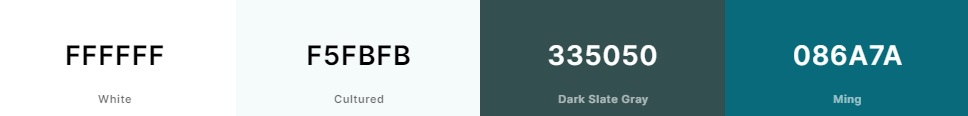

# Plushies
## Table of Contents
* [Introduction](#introduction)
* [UX](#ux)
    * [User Stories](#users-tories)

# Introduction
It is the final project for the 'Full Stack Frameworks with Django' module at Code Institute. The Plushies project is an eCommerce shop that is offering to sell plushies.
Please note that this website is for eductional purposes. Do not enter any personal credit/debit card details.
## Testing Payment with Stripe
As a way of exemplifying how the payment functionality works, Stripe provides three types of payment events and their respective card numbers: successful payment, requires authentication and failed payment.

| Payment event | Card Number
|:---:|:---:|
|Successful payment|4242 4242 4242 4242
|Requires authentication|4000 0025 0000 3155
|Failed payment|4000 0000 0000 9995

Additional information:
* Use a valid future date.
* Use any three-digit CVC.

# UX

## User Stories
### User
* As a user, I want to view a list of products to purchase.
* As a user, I want to view selected individual product details, the price, size,description and image.
* As a user, I want to view the total of my purchases at any time.
* As a user, I want to view a store contant information.
* As a user, I want to register an account, so I can have a pesonal account to view my profile.
* As a user, I want to login and logout to access my personal account information.
* As a user, I want to be able recover my password so I have access to my account.
* As a user, I want to receive an email confirmation after registering account to verify that my account registration was successful.
* As a user, I want to have a poersonalised user profile so I can view my order history and order confirmations, and save my payment information.
* As a user, I want to sort the list of available products by price, by name or by category name.
* As a user, I want to sort a specific category of product by price or by name.
* As a user, I want to search for product by name or description to find specific product.
* As a user, I want to see what I've searched for and how many products was found.
* As a user, I want to select the size and quantity of a product.
* As a user, I want to view products in my cart and identify total cost of my purchase.
* As a user, I want to modify the quantity of individual items in the cart, so I can make a change to my purchase before checkout.
* As a user, I want to view items in the cart to be purchased and its total cost.
* As a user, I want to modify the quantity of individual item in the cart, so I can easily change it before checkout.
* As a user, I want to easily enter my payment information so I can checkout quickly.
* As a user, I want to view on order confirmation after checkout.
* As a user, I want to receive an email confirmation after checkout, to keep the confirmation for my records.
### Store Owner
* As a store owner, I want to add product to my store.
* As a store owner, I want to edit details product.
* As a store owner, I want to delete a products that are no longer for sale.

## Design

The colors palettes for website layout are Cultured, White, and Dark Slate Grey. For the links in the Register and Login page is used Ming color.

## Wireframes
I created wireframes in the Balsamiq program as first visual concept of the website.

### Mobile Wireframes
PDF file here

### Desktop Wireframes
PDF file here

## Database
To create database schema I used [dbdiagram.io](https://dbdiagram.io/)

# Technologies Used
##  Languages
* HTML5
* CSS3
* Python
* Javascript
## Libraries and Programs
* [Git](https://git-scm.com/) - Git was used for version control.
* [GitHub](https://github.com/) - GitHub was used for storing code and deploying the site.
* [Gitpod](https://www.gitpod.io/) - GitPod was used for building and editing my code.
* [Heroku](https://www.heroku.com/) - Heroku was used to deploy the project.
* [Django](https://www.djangoproject.com/) - Django was used for creating store website.
* [PostgreSQL](https://www.postgresql.org/) - PostgreSQL was used to store products, products sizes and categories, users, user's profiles, orders colections in the database
* [AWS S3](https://aws.amazon.com/s3/) - AWS S3 was used for storing media and static files.
* [Stripe](https://stripe.com/en-gb) - Stripe was used for payment gateway.
* [Bootstrap 5](https://getbootstrap.com/docs/5.2/getting-started/introduction/) - Bootstrap 5 was used to desgin responsive website.
* [jQuery](https://jquery.com/) - jQuery was used to implement JavaScript.
* [Chrome Developer Tools](https://developers.google.com/web/tools/chrome-devtools) - Chrome Developer Tools was used to help fix problem areas and identify bugs.
* [Font Awesome](https://fontawesome.com/) - The icons for cookie logo, social media and buttons were taken from Font Awesome.
* [Google Fonts](https://fonts.google.com/) - The font 'Raleway' was imported from Google Fonts.
* [Balsamiq](https://balsamiq.com/) - Balsamiq was used to make Desktop and Mobile Wireframes.
* [Am I Responsive?](http://ami.responsivedesign.is/#) - Website used to create mockup image for this README file.

