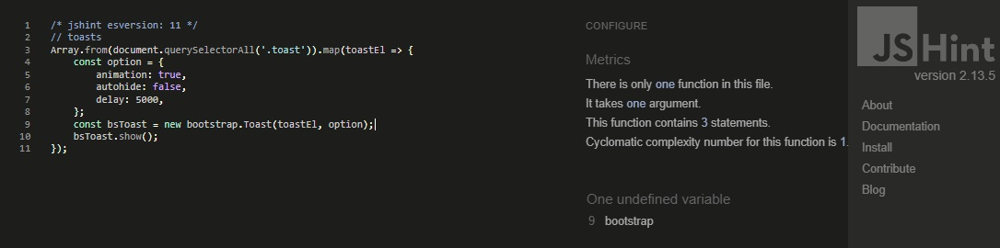

# Plushies - Testing
# Manual Testing of the User Stories
User Story | Testing | Pass
--- | --- | :---:
As a user  I want to view a list of products to purchase. | As a user on the Home page I navigate to the Shop -> All Plushies to see all products or choose category that I'm interesed in. | :heavy_check_mark:
As a user  I want to view selected individual product details, the price, size, description and image. | As a user on the shop page or on the one of the plushies categories page I click individual product (either on the name or image). It takes me to the page with product details. I can easily notice product's name, available product's sizes, product's price, product's description and product's image. | :heavy_check_mark:
As a user  I want to view the total of my purchases at any time. | As a user I add items in the cart and I can see total of my purchases on every page on desktop and mobile | :heavy_check_mark:
As a user  I want to view a store contact information. | As a user I can navigate to the Contact Page. I can easily notice opening hours of the store and three ways of contact with store team, via message, email or phone. | :heavy_check_mark:
As a user  I want to contact easily with store owner via message form. | As a user on the Contact Page I can fill in message form to contact with the store. I have to fill all the fields. The email field has to be an email input to submit the form. After submiting the form I can see 'Thanks for your message!' notification, the form is empty, and ready to send another one. | :heavy_check_mark:
As a user  I want to register an account, so I can have a pesonal account to view my profile. | As a user I can navigate to the User Icon and from dropdown menu choose Register. To register account I need to provide E-mail address, Username, Password and click Register button. I can see notification that 'Confirmation email was sent to kewetop217@invodua.com' and I need to verify my email address. | :heavy_check_mark:
As a user  I want to receive an email confirmation after registering account to verify that my account registration was successful. | During registration process I received Email Verification link.  Once I confirm my email, I got redirect to Log In Page with notification 'You have confirmed kewetop217@invodua.com'.  | :heavy_check_mark:
As a user  I want to login and logout to access my personal account information | As registered user I can login provide username or email address and my password, I got redirect to Home Page with notification 'Successfully signed in as my username.' On the navbar I can navigate through user icon and dropdown menu to My Profile Page. On the Profile Page I can provide my delivery information, such as: Phone Number, Street Address, City, County, Post Code and Country. I can see my order history, which is empty for now. | :heavy_check_mark:
As a user  I want to easily enter my payment information so I can checkout quickly. | On the My Profile page I can add my details into Default Delivery Information form with Phone Number, Street Address, City, County, Post Code and Country, and click update information button. | :heavy_check_mark:
As a user  I want to be able recover my password so I have access to my account | On the Log In Page I can choose 'Forgot the password' option. I been redirect to the Password Reset Page where I can provide my email address and click Reset My Password button. I've been informed that Email with Password Reset was send. I check my mailbox and now I can change my Password to new one. I've set my new password and I've been notify that 'Password successfully changed.' | :heavy_check_mark:
As a user  I want to have a personalised user profile so I can view my order history and order confirmations, and save my payment information. | As a user I can navigate to the My Profile page and save my Default Delivery Information. I can easly check my Order History and navigate to the details of the specific order by clicking on the order number. It redirect me to the History Order Details where I can check information about order number, order date, what products I ordered with quantity and price, total payment charges, and delivery information that were used to send products to me. | :heavy_check_mark:
As a user  I want to sort the list of available products by price, by name or by category name. | As a user I can navigate to the Shop All Plushies to see all products. I can choose the way I want to sort products on the page. I can sort products by price (from the lowest to the highest, and from the highest to the lowest), by name (from A to Z, and from Z to A), by category (from A to Z and from Z to A). | :heavy_check_mark:
As a user  I want to sort a specific category of product by price or by name. | As a user I can navigate to the Animals Plushies, Food Plushies, or Gaming Plushies and sort products only in the chosen category by price or by name. | :heavy_check_mark:
As a user  I want to search for product by name or description to find specific product. | As a user I can search for product on the search box in the navbar. I can enter product's name or color that I am interested in, and it finds me products if exists. | :heavy_check_mark:
As a user  I want to see what I've searched for and how many products was found | As a user I want to search for red product, I can see on the page how many products found for resukt "red". If I type query that does not find products for I can see on the page that it found '0 results for "batman"'. If I enter empty search I got notification error with message 'Search criteria empty!' | :heavy_check_mark:
As a user  I want to select the size and quantity of a product. | As a user I can navigate to the selected product and choose beetween available sizes of the product. I can choose quantity of the product. | :heavy_check_mark:
As a user  I want to view products in my cart and identify total cost of my purchase. | As a user I can navigate to the shopping cart. I can easly see how many products I have in my cart for what price. I can identify total cost of my purchase on the bottom of the shopping cart. | :heavy_check_mark:
As a user  I want to modify the quantity of individual items in the cart, so I can make a change to my purchase before checkout. | As a user in the shopping cart with chosen products to purchase I can easly modify quantity of my products, by decreasing or increasing buttons. | :heavy_check_mark:
As a user  I want to view on order confirmation after checkout. | As a user I provided necesery information and purchased items. I can see order confirmation page with order details. | :heavy_check_mark:
As a user  I want to receive an email confirmation after checkout, to keep the confirmation for my records. | As a user after successfull checkout I received email confirmation. | :heavy_check_mark:
As a store owner  I want to add product to my store. | As a store owner, once logged on my admin user, I can navigate to the user icon and from dropdown menu I can click on the Admin. I can add product via Add Product Form, where I can choose category and size, add name, description, price, color, country that product was made in, and image but it is not required. If I add product without image it render with image placeholder bear. It is better for store when products has images. | :heavy_check_mark:
As a store owner  I want to edit details product. | As a store owner I can edit products on the shop page or in the product's details page by clicking the edit button. It redirects me to the edit page with notification of what Product I am editing. I can change any field and click button to update the chosen product. | :heavy_check_mark:
As a store owner  I want to delete a products that are no longer for sale. | As a store owner I can delete products on the shop page or in the product's details page by clicking the delete button. I can see pop up information if I am sute to delete chosen product, and I can choose to cancel or delete it. It redirects me to the shop page with notification 'Product deleted!'. | :heavy_check_mark:

# Code Validation
## HTML5 Validation
I used [HTML5 Validator](https://validator.w3.org/) to validate my html code. I validate by URI and by Direct Input.

Home

Shop - All Categories

Food Plushies

Gaming Plushies

Animales Plushing

Contact

Cart

Checkout

Checkout Success

Register

Log In

Log Out

Profile

Order History

Add-product

## CSS3 Validation
I used [CSS3 Validator](https://jigsaw.w3.org/css-validator/) to validate my css code. I validate by file upload.

base.css

checkout.css

profile.css

## JavaScript Validation
I used [JSHint Validator](https://jshint.com/) to validate my javascript code. I validate by direct input.

Base

Cart

Checkout

Products

Products Quantity

Profiles

